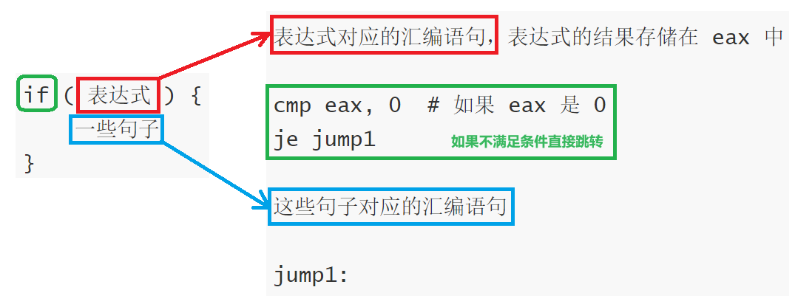
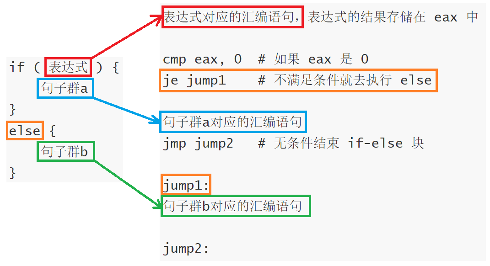
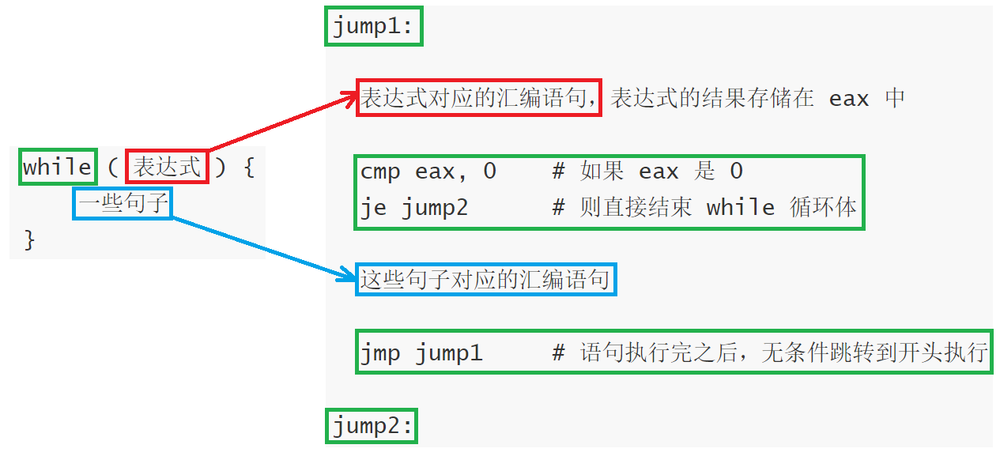
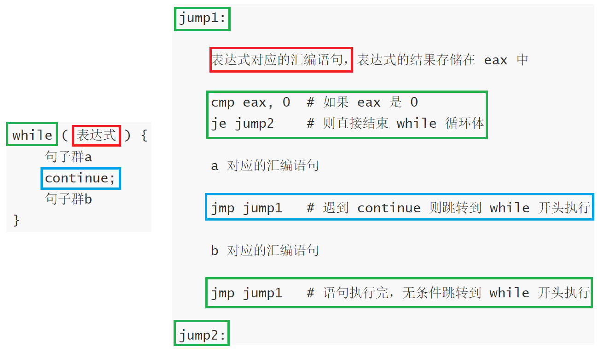
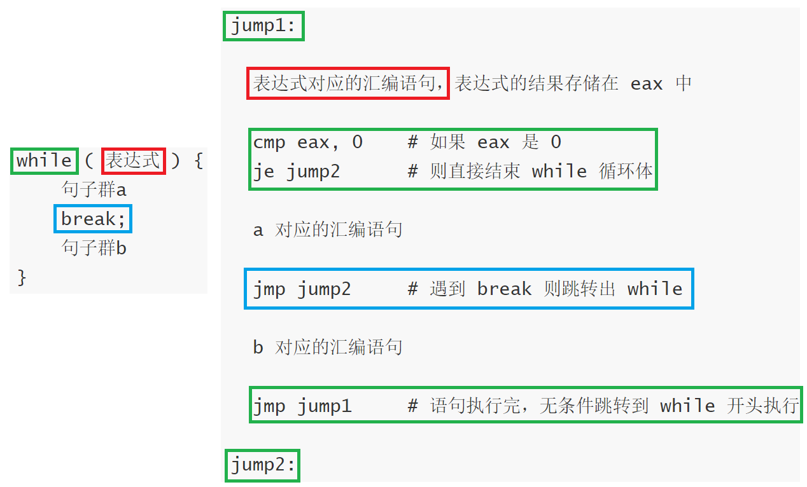

# 实验四：四代编译器实验

## 一、实验要求

详细实验要求请参考文件《Lab4实验说明和要求.pdf》。


## 二、文件

共包括五个文件：

- main_without_arg.cpp

  是可以在本地直接编译使用的源文件，是用于测试输入输出结果的文件。

  注意每次输入结束后，需要另起一行，并在该行输入+++（3个加号）才能终止输入并显示输出。

- main.cpp

  是根据实验平台提交要求修改了输入输出方式的文件，**是最终提交的文件之一**。

- F.h

  用于声明函数，**是最终提交的文件之二**。

- F.cpp

  用于具体定义 F.h 中的函数，**是最终提交的文件之三**。
  
- CMakeLists.txt

  用于组装文件，**是最终提交的文件之四**。


## 三、实验思路

### 1、与 lab3 的对比

如果你在 lab3 就已经像我一样单独写了个函数处理**表达式**，那么理论上，lab4 相比于 lab3，不过就是多了对 `if` 和 `while` 等语句的处理，而其他部分几乎不需要任何改变！

这样一来，lab4 就非常简单了。因此，本文是基于 lab3 的代码上进行修改，关于 lab3 的文章在这里：[BIT 2024 编译原理 Lab. 3 三代编译器实验说明和要求-CSDN博客](https://blog.csdn.net/m0_70241024/article/details/139033840?spm=1001.2014.3001.5502)

### 2、函数的划分

现在，不能简单地通过 `}` 的出现位置来区分不同的函数块，这是因为函数内的 `if` 或 `while` 语句块通常也会出现 `}`.

如果你仍然希望实现预先对函数进行划分，一种可行的做法是：维护一个变量 `left_brace_minus_right_brace`，它等于 `左大括号的数量-右大括号的数量`，当且仅当 `}` 的位置满足`left_brace_minus_right_brace = 0` 时，表明这个 `}` 用于划分函数是有效的。

### 3、句子的识别

现在，句子不总是以 `;` 作为结尾，因为 `if` 或 `while` 语句块通常以 `}` 结尾，这意味着仅使用 `;` 分割两个句子是不完全正确的。为了解决这个问题，你需要添加一些其他的条件判断。（自己想哈）

### 4、句子的处理

**注意：这里仅提供我的方法，实际上你应该结合自己的理解和自己的代码进行修改！**

对于 `if` 和 `while` ，你觉得一个句子应该在什么地方进行划分？

我这里的做法简单来说，是按照有效**（有效：左大括号的数量和右大括号的数量达到了平衡）**的 `}` 进行划分，我举一个例子。有如下代码：

```
if ( a>3 ) {
	if ( a<10 ) {
		println_int(a);
	}
	while ( a<b ) {
		println_int(b);
		a=a+1;
	}
}
```

那么，对于上面的例子，我认为

```
if (a>3) { if (a<10) { println_int(a); } while (a<b) { println_int(b); a=a+1; } }
         Δ																		Δ
```

是一个句子。在这个句子中，含有两个子句，它们分别是

```
if (a<10) { println_int(a); }
		  Δ					Δ
while (a<b) { println_int(b); a=a+1; }
			Δ					 	 Δ
```

对于前者，它又含有一个子句

```
println_int(a);
```

对于后者，它含有两个子句，分别是

```
println_int(b);
a=a+1;
```

这样的结构，令我想到了递归。显然，如同我在 lab3 中单独写一个函数处理**表达式**，现在，我要单独写一个函数处理**句子**。

再次重申下表达式和句子的区别。**表达式**的本质是一个值，不管是一个数字、变量、调用函数、简单的运算还是复杂的运算，总之，它最后一定会被计算出一个值；**句子**是有明确语法含义的，比如说赋值语句、输出语句、`if` 语句等等。

唯一特殊的例子是调用返回值是 `void` 类型的函数，虽然它本身不返回任何值，因为它的处理跟返回值是 `int` 类型的函数完全相同，可以顺便当表达式处理了。当然啦，你也可以认为它是句子，反正你总得想办法处理它吧。

对于一个句子，直接调用该函数；如果句子内部又含有句子，则**递归**调用这个函数。

说实话，到这个时候，我也不敢说自己的做法是不是高明，所以请你自己认真思考一下，结合你自己手头上代码，你会用什么样的方法来处理 `if` 或 `while` 的语句块？

### 5、`if` 对应的汇编语句

`if` 语句处理十分简单，在不考虑 `else` 的情况下，它的代码结构一定是：

```
if ( 表达式 ) {
	一些句子
}
```

对应的汇编是：



如果考虑 `else`，代码结构如下：

```
if ( 表达式 ) {
	句子群a
}
else {
	句子群b
}
```

对应的汇编是：



### 6、`while` 对应的汇编语句

 `while` 语句处理相比于 `if` 稍微复杂一些，我们先不考虑 `continue` 和 `break`，它的代码结构一定是：

```
while ( 表达式 ) {
	一些句子
}
```

对应的汇编是：



`while` 的内部每多一个 `continue`，内部就多一个命令跳转到 `while` 开头，如下图所示：



`while` 的内部每多一个 `break`，内部就多一个命令跳转出 `while`，如下图所示：



你最好先理解了再写代码，不然写起来会很费劲的。

### 7、多个 `return` 

例如下面的代码：

```
int bigger(int a, int b) {
	if (a>b) {
		return a;
	}
	else {
		return b;
	}
}
```

存在多个 `return`，你可以把结果放在 `eax` 上，然后在函数的最后为 `return` 设置 `jump` 入口，于是上述代码对应的汇编代码可能是：

```
bigger:
  push ebp
  mov ebp, esp
  sub esp, 16
  
  mov eax, DWORD PTR [ebp+8]
  push eax
  mov eax, DWORD PTR [ebp+12]
  push eax
  pop ebx
  pop eax
  cmp eax, ebx
  setg al
  movzx eax, al
  push eax
  pop eax
  cmp eax, 0
  je jump1

  # return a; 对应的汇编
  mov eax, DWORD PTR [ebp+8]
  jmp jump2
  
  jump1:
  # return b; 对应的汇编
  mov eax, DWORD PTR [ebp+12]
  jmp jump2
    
  jump2:
  leave
  ret
```

`return` 其实和 `break` 有点像，只是 `jump` 的地方通常和 `break` 不同。


## 四、实验注意

1. 该部分主要阐述本人在做该实验时踩过的坑

2. 提交方式：和 lab3 一样

3. 局部变量

   这里指的是 `if` 和 `while` 内部定义的变量，例如：

   ```
   if (a==b) {
   	int c;
   	c = a+b;
   	println_int(c);
   }
   ```

   有时候，你可能需要注意对这种变量的处理。（但是我代码里没有考虑竟然也过了，好耶！）

4. 用例 3：注意自定义函数的 `if` 内部的 return

5. 用例 6：`continue` 或 `break` 并不是只能出现在 `while` 内部，它也可能出现在 `if` 的内部（当然其实也算是在 `while` 的内部啦）

6. 诸如 `if` 或 `while` 不带有 `{}` 的情形在 lab4 中不存在，即不存在下面这种样式：

   ```
   if (a>1) a=1;
   ```

7. `while` 内部的**直接** `return` 不需要考虑，形如：

   ```
   while ( 条件 ) {
   	一些语句
   	return;
   }
   ```

   但**间接**存在的 `return` 仍然需要考虑，例如：

   ```
   while ( 条件1 ) {
   	一些语句
   	if ( 条件2 ) {
   		return;
   	}
   }
   ```

   你怎么知道我在明知道应该考虑却没写进去的情况下直接交代码还不小心全对的？！！

8. 最后，祝愿大家早日 AC


朱逸晨  2024.6.3  ver1.3


